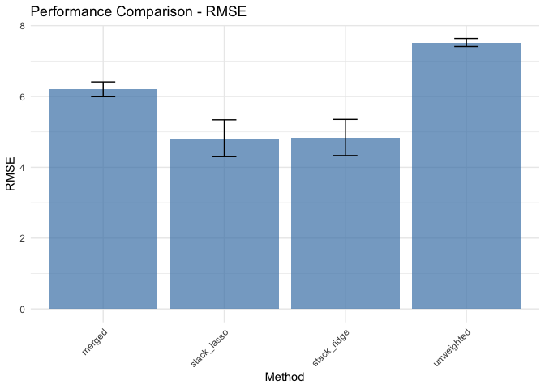
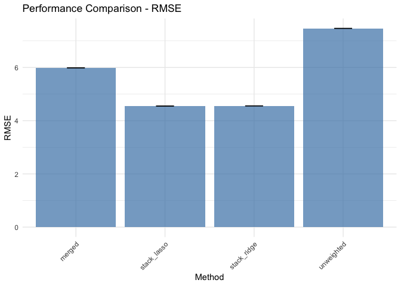

Cross-Cluster Weighted Forests
================

## Introduction

The `rCCWF` package implements Cross-Cluster Weighted Forests, an
ensemble learning approach that combines clustering with random forests
to improve prediction accuracy. This method is particularly effective
when dealing with heterogeneous data that naturally forms clusters or
when different subpopulations exist within your dataset.

Load the necessary packages:

``` r
library(rCCWF)
library(dplyr)
library(ggplot2)
```

## Basic Usage

Simple example using simulated data:

``` r
# Set seed for reproducibility
set.seed(123)

# Simulate data with known clusters
sim_data <- sim_data_monte(
  nclusters = 5,  # Number of training clusters
  ncoef = 20,     # Number of predictor variables
  ntest = 2       # Number of test datasets
)

# Examine the structure
names(sim_data)
#> [1] "clusters_list" "test_list"
```

## Working with Pre-clustered Data

If you already have data that’s naturally clustered or split:

``` r
# Use the pre-clustered data directly
results <- cluster_ensemble_workflow(
  train_data = sim_data$clusters_list,
  test_data = sim_data$test_list,
  cluster_ind = FALSE,  # Don't perform additional clustering
  merged_trees = 500,
  cluster_trees = 100
)
```

## Using k-means clustering on data that is partitioned

If you already have data that’s naturally clustered or split:

``` r
# Use the pre-clustered data directly
results <- cluster_ensemble_workflow(
  train_data = sim_data$clusters_list,
  test_data = sim_data$test_list,
  cluster_ind = TRUE,  # We do perform additional clustering
  n_clusters = 5,
  merged_trees = 500,
  cluster_trees = 100
)

print(results$average_performance)
#> # A tibble: 4 × 3
#>   method      avg_rmse sd_rmse
#>   <chr>          <dbl>   <dbl>
#> 1 merged          6.40   0.385
#> 2 stack_lasso     5.15   0.724
#> 3 stack_ridge     5.16   0.721
#> 4 unweighted      7.75   0.419
```

## Understanding the Predictions

The package provides four types of predictions:

1.  `merged`: Predictions from a single random forest trained on all
    data
2.  `unweighted`: Simple average of individual cluster model predictions
3.  `stack_ridge`: Ridge regression weighted combination
4.  `stack_lasso`: Lasso regression weighted combination

``` r
# Examine predictions for first test set
head(results$predictions[[1]])
#> # A tibble: 6 × 4
#>   merged unweighted stack_ridge stack_lasso
#>    <dbl>      <dbl>       <dbl>       <dbl>
#> 1  3.99        3.60       1.94        1.97 
#> 2  4.18        4.72       4.45        4.59 
#> 3 18.7        12.8       20.8        21.0  
#> 4  9.81        7.38      10.3        10.6  
#> 5 -0.754       2.70       0.319       0.399
#> 6 18.2        12.2       20.2        20.6
```

## Performance Comparison

``` r
# For multiple test sets
print(results$average_performance)
#> # A tibble: 4 × 3
#>   method      avg_rmse sd_rmse
#>   <chr>          <dbl>   <dbl>
#> 1 merged          6.40   0.385
#> 2 stack_lasso     5.15   0.724
#> 3 stack_ridge     5.16   0.721
#> 4 unweighted      7.75   0.419

# Visualize performance
plot_performance_comparison(results)
```

<!-- -->

## Working with Single Datasets

For a single dataset that needs to be clustered (set cluster_ind = TRUE
in this case):

``` r
# Combine training data
combined_train <- sim_data$clusters_list |> dplyr::bind_rows()
test_data <- sim_data$test_list[[1]]

# Run workflow with automatic clustering
results_single <- cluster_ensemble_workflow(
  train_data = combined_train,
  test_data = test_data,
  n_clusters = 5,
  cluster_ind = TRUE,
  merged_trees = 500,
  cluster_trees = 100
)

# Plot performance comparison
plot_performance_comparison(results_single)
```

<!-- -->

## Advanced Usage: Simulation Studies

The package includes functions for simulation studies:

``` r
# Compare Gaussian and non-Gaussian clusters
gaussian_data <- sim_data_gaussian(5, 20, 2)
monte_data <- sim_data_monte(5, 20, 2)

# Run analysis on both
results_gaussian <- cluster_ensemble_workflow(
  train_data = gaussian_data$clusters_list,
  test_data = gaussian_data$test_list,
  cluster_ind = FALSE
)

results_monte <- cluster_ensemble_workflow(
  train_data = monte_data$clusters_list,
  test_data = monte_data$test_list,
  cluster_ind = FALSE
)

# Compare results
bind_rows(
  Gaussian = results_gaussian$average_performance,
  Monte = results_monte$average_performance,
  .id = "simulation"
) |>
  arrange(method)
#> # A tibble: 8 × 4
#>   simulation method      avg_rmse sd_rmse
#>   <chr>      <chr>          <dbl>   <dbl>
#> 1 Gaussian   merged          7.94   0.120
#> 2 Monte      merged          7.10   0.649
#> 3 Gaussian   stack_lasso     9.40   0.427
#> 4 Monte      stack_lasso     5.39   0.165
#> 5 Gaussian   stack_ridge     8.67   0.273
#> 6 Monte      stack_ridge     5.43   0.188
#> 7 Gaussian   unweighted      8.27   0.368
#> 8 Monte      unweighted      8.42   0.676
```

## Tips and Best Practices

1.  **Choosing the Number of Clusters**
    - Start with domain knowledge if available
    - Try different values and compare performance
    - Consider the silhouette score or other clustering metrics
2.  **Tree Parameters**
    - Use more trees (`merged_trees`) for the merged model
    - Fewer trees (`cluster_trees`) for individual cluster models
    - Balance computation time vs. performance
3.  **When to Use CCWF**
    - Heterogeneous data with natural clusters, multiple datasets
    - I.e. large datasets with potential subpopulations, data prone to
      batch effects, etc.

## Session Info

``` r
sessionInfo()
#> R version 4.3.2 (2023-10-31)
#> Platform: aarch64-apple-darwin20 (64-bit)
#> Running under: macOS Sonoma 14.5
#> 
#> Matrix products: default
#> BLAS:   /Library/Frameworks/R.framework/Versions/4.3-arm64/Resources/lib/libRblas.0.dylib 
#> LAPACK: /Library/Frameworks/R.framework/Versions/4.3-arm64/Resources/lib/libRlapack.dylib;  LAPACK version 3.11.0
#> 
#> locale:
#> [1] en_US.UTF-8/en_US.UTF-8/en_US.UTF-8/C/en_US.UTF-8/en_US.UTF-8
#> 
#> time zone: America/Los_Angeles
#> tzcode source: internal
#> 
#> attached base packages:
#> [1] stats     graphics  grDevices utils     datasets  methods   base     
#> 
#> other attached packages:
#> [1] glmnet_4.1-8  Matrix_1.6-5  ggplot2_3.5.1 dplyr_1.1.4   rCCWF_0.1.0  
#> 
#> loaded via a namespace (and not attached):
#>  [1] tidyselect_1.2.1        timeDate_4032.109       farver_2.1.2           
#>  [4] Rmpfr_1.0-0             fastmap_1.2.0           digest_0.6.37          
#>  [7] rpart_4.1.23            timechange_0.3.0        lifecycle_1.0.4        
#> [10] cluster_2.1.6           yardstick_1.3.1         survival_3.7-0         
#> [13] magrittr_2.0.3          compiler_4.3.2          rlang_1.1.4            
#> [16] tools_4.3.2             utf8_1.2.4              yaml_2.3.10            
#> [19] data.table_1.15.4       knitr_1.48              clusterGeneration_1.3.8
#> [22] labeling_0.4.3          bit_4.0.5               DiceDesign_1.10        
#> [25] parsnip_1.2.1           nleqslv_3.3.5           withr_3.0.1            
#> [28] purrr_1.0.2             workflows_1.1.4         nnet_7.3-19            
#> [31] grid_4.3.2              tune_1.2.1              fansi_1.0.6            
#> [34] colorspace_2.1-1        future_1.34.0           GPArotation_2024.3-1   
#> [37] globals_0.16.3          scales_1.3.0            iterators_1.0.14       
#> [40] MASS_7.3-60.0.1         cli_3.6.3               mvtnorm_1.3-2          
#> [43] rmarkdown_2.27          generics_0.1.3          rstudioapi_0.16.0      
#> [46] future.apply_1.11.2     CVXR_1.0-15             dials_1.3.0            
#> [49] splines_4.3.2           parallel_4.3.2          fungible_2.4.4         
#> [52] vctrs_0.6.5             hardhat_1.4.0           bit64_4.0.5            
#> [55] clue_0.3-66             pbmcapply_1.5.1         listenv_0.9.1          
#> [58] foreach_1.5.2           gower_1.0.1             tidyr_1.3.1            
#> [61] recipes_1.1.0           glue_1.7.0              parallelly_1.38.0      
#> [64] codetools_0.2-20        rsample_1.2.1           DEoptim_2.2-8          
#> [67] lubridate_1.9.3         shape_1.4.6.1           gtable_0.3.5           
#> [70] gmp_0.7-5               Rcsdp_0.1.57.5          munsell_0.5.1          
#> [73] GPfit_1.0-8             tibble_3.2.1            furrr_0.3.1            
#> [76] pillar_1.9.0            htmltools_0.5.8.1       ipred_0.9-15           
#> [79] lava_1.8.0              R6_2.5.1                lhs_1.2.0              
#> [82] evaluate_0.24.0         lattice_0.22-6          highr_0.11             
#> [85] class_7.3-22            Rcpp_1.0.13             prodlim_2024.06.25     
#> [88] ranger_0.16.0           xfun_0.46               pkgconfig_2.0.3
```

\`\`\`
